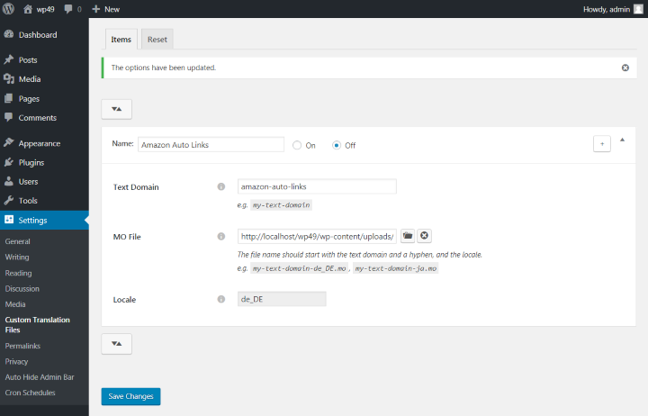

# [Custom Translation Files](http://wordpress.org/plugins/custom-translation-files/) #

### Welcome to our GitHub Repository

Custom Translation Files is an open source WordPress plugin that allows you to set custom translation files for a particular text domain. 

    

## Screenshots ##

	
	&nbsp;

## Installation ##

- The latest development version can be found [here](https://github.com/michaeluno/custom-translation-files/branches). 
- The latest stable version can be downloaded [here](http://downloads.wordpress.org/plugin/custom-translation-files.latest-stable.zip).

1. Upload **`custom-translation-files.php`** and other files compressed in the zip folder to the **`/wp-content/plugins/`** directory.,
2. Activate the plugin through the `Plugins` menu in WordPress.

## How to Use ##

1. Upload **`custom-translation-files.php`** and other files compressed in the zip folder to the **`/wp-content/plugins/`** directory.
2. Activate the plugin through the 'Plugins' menu in WordPress.
3. Go to **Dashboard** -> **Appearance** -> **Scrollbars**.
4. Configure the options by setting a selector and height.

## Bugs ##
If you find an issue, let us know [here](https://github.com/michaeluno/custom-translation-files/issues)!

## Support ##
This is a developer's portal for Custom Translation Files and should _not_ be used for support. Please visit the [support forums](http://wordpress.org/support/plugin/custom-translation-files).

## Contributions ##
Anyone is welcome to contribute to Custom Translation Files.

There are various ways you can contribute:

1. Raise an [Issue](https://github.com/michaeluno/custom-translation-files/issues) on GitHub.
2. Send us a Pull Request with your bug fixes and/or new features.
3. Provide feedback and suggestions on [enhancements](https://github.com/michaeluno/custom-translation-files/issues?direction=desc&labels=Enhancement&page=1&sort=created&state=open).

## Supporting Future Development ##

If you like it, please rate and review it in the [WordPress Plugin Directory](http://wordpress.org/support/view/plugin-reviews/custom-translation-files?filter=5). Also donation would be greatly appreciated. Thank you!

 

## Copyright and License ##

### Custom Translation Files ###
Released under the [GPL v2](./LICENSE.txt) or later.
Copyright © 2015 [COPYRIGHT_HOLDER]

This program is free software; you can redistribute it and/or modify
it under the terms of the GNU General Public License as published by
the Free Software Foundation; either version 2 of the License, or
(at your option) any later version.

This program is distributed in the hope that it will be useful,
but WITHOUT ANY WARRANTY; without even the implied warranty of
MERCHANTABILITY or FITNESS FOR A PARTICULAR PURPOSE.  See the
GNU General Public License for more details.

You should have received a copy of the GNU General Public License along
with this program; if not, write to the Free Software Foundation, Inc.,
51 Franklin Street, Fifth Floor, Boston, MA 02110-1301 USA.